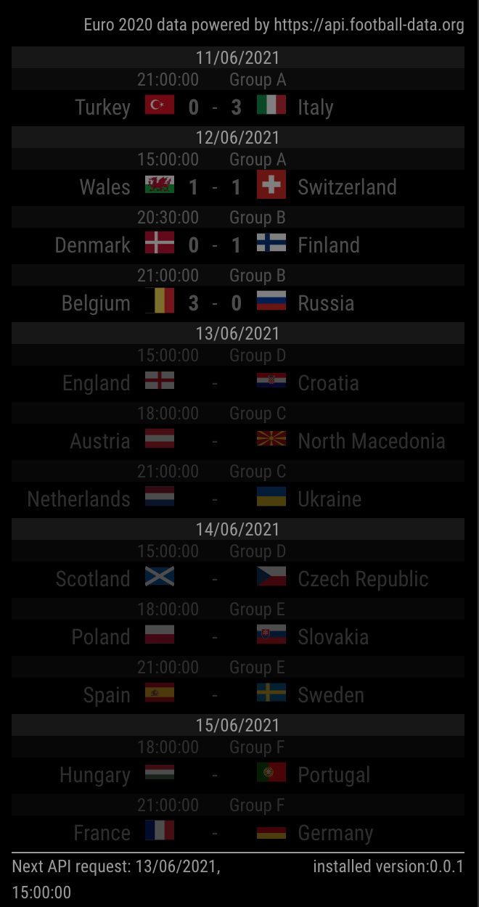

# MMM-euro2021
a Magic Mirror Module to display Euro 2020 fixtures and standings

## PREREQUISITES
create an account https://www.football-data.org/ and obtain your token.  
Create a file named .secret.js (see .secret.js.EXAMPLE) and add your token in there.  

## INSTALLATION
This 3rd party module install just like any other.  
This Magic Mirror Forum thread describe a step-by-step procedure to install: [How to add modules. For absolute beginners.](https://forum.magicmirror.builders/topic/4231/how-to-add-modules-for-absolute-beginners?_=1622723520331)

## CONFIGURATION
the default configuration looks like this:
```js
{
  disabled: false,
  module: "MMM-euro2021",
  position: "bottom_center",
  defaults: {
    updateInterval: 60 * 1000, // one minute
  },
}
```
__BE AWARE OF THE REQUEST LIMIT FOR THE FREE TIER OF THE API__

## SCREENSHOT


### views and clone stats


